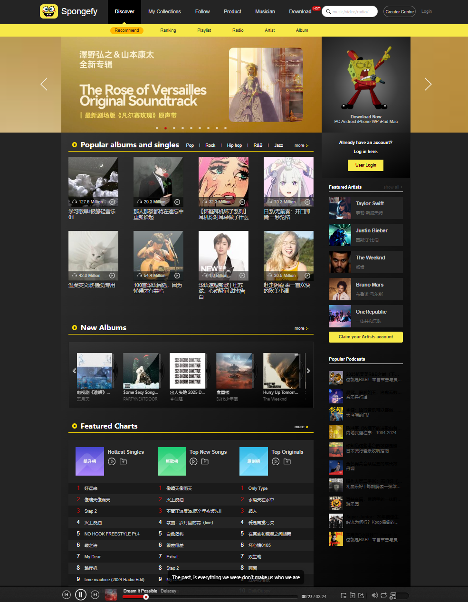

# Spongefy Web Player

Spongefy Web Player is a modern React and TypeScript web application built using Vite that offers an engaging interface to explore music through sections like **Popular Albums and Singles**, **New Albums**, and **Featured Charts**. It also features a music widget based on the HTML audio element for seamless audio playback, and leverages Redux to maintain and manage user playlists.

## Screenshot



## Live Demo

Experience the app live at: [https://spongefy-web-player.onrender.com](https://spongefy-web-player.onrender.com)

## Features

- **Popular Albums and Singles:** Discover trending music.
- **New Albums:** Stay updated with the latest music releases.
- **Featured Charts:** Browse through curated music charts.
- **Music Widget:** Enjoy seamless playback with the integrated music widget.
- **Playlist Management:** Manage your personal playlist powered by Redux.
- **Open Source Music Data:** Fetches data from an open source API (note: some tracks may be unavailable due to copyright or regional restrictions).

## Tech Stack

- **Frontend:** React, TypeScript
- **Build Tool:** Vite
- **State Management:** Redux
- **CSS Pre-processor:** Less
- **Styling:** Styled Components
- **UI Library:** Antd for UI components and icon library
- **Node Version:** 22.13.0

## Installation and Setup

### Prerequisites

- [Node.js](https://nodejs.org/) version **22.13.0** (or compatible) installed.
- npm (comes bundled with Node.js).

### Steps

1. **Clone the Repository:**

   ```bash
   git clone https://github.com/Michael-YZhou/Spongefy-Web-Player.git
   cd Spongefy-Web-Player
   ```

2. **Install Dependencies:**

   ```bash
   npm install
   ```

3. **Run the App in Development Mode:**

   ```bash
   npm run dev
   ```

4. **Building for Production:**

   To create a production-ready build:

   ```bash
   npm run build
   ```

   After building, you can preview the production build locally:

   ```bash
   npm run preview
   ```

